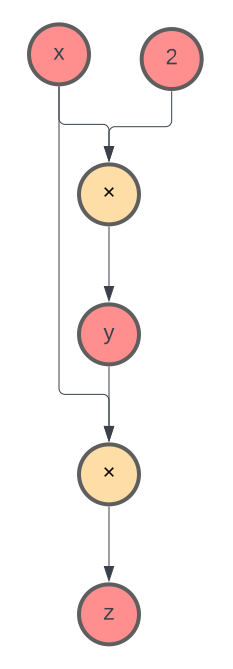
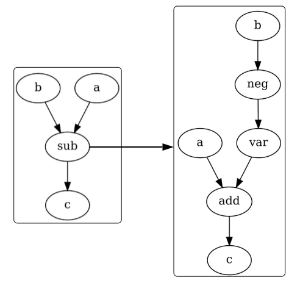

# Understanding CSDL: Working with Recorder, Graphs, and Nodes

## Building Graphs

When using CSDL, you will mainly be working with CSDL variables and operations, which are both CSDL `Node` objects. While CSDL code is written in a similar way to regular python code, CSDL code is compiled to a CSDL `Graph` object by the `Recorder` class, that can be optimized and executed efficiently. This means that operations are not executed immediately, and variables may not have a set value until the graph is executed. However, the `Recorder` class provides a way to execute CSDL code inline, which can be useful for debugging and testing. Inline values can be accessed by the `value` attribute of the variable.

For example, the following code snippet

```python 
recorder = Recorder()
recorder.start()
x = csdl.Variable((1,))
y = x * 2
z = y*x
recorder.stop()
```
becomes the following graph represented in the `Recorder`:


```{figure} /src/images/basic_graph.svg
:figwidth: 20 %
:align: center
:alt: dag
 
```

<!--  -->

Creating a variable via `csdl.Variable()` simultaniously creates a node in the graph, and performing operations on variables creates `Operation` nodes, in addition to creating nodes for output variables and any non-variable inputs. Additionally, edges are created between nodes to represent the flow of data through the graph. Note that the variable objects that exist in code you write and the variable nodes in the graph are on in the same.

CSDL graphs are directed acyclic graphs (DAGs), meaning that they have no cycles and data flows in one direction. This allows for efficient optimization and execution of the graph. Additionally, the graph is bipartite, meaning that nodes can be divided into two sets, variables and operations, and edges only connect nodes from different sets. While implicit relationships may exist within your model, they must be resolved into explicit relationships in the graph.

## Subgraphs

To simplify the graph, CSDL collapses parts of the graph into single operation nodes, which themselves contain a graph. For example, a subtraction operation is represented by a single node in the graph, which itself contains a graph with a negation and an addition operation. This allows for more efficient optimization and execution of the graph. The `Recorder` keeps track of the subgraphs via a tree structure, where each node represents a subgraph.

```{figure} /src/images/sub_composite.svg
:figwidth: 60 %
:align: center
:alt: supop
 
```

## Variables

Variables represent values in CSDL, and are generally n-dimensional arrays. While a variable may not have a specific value until the graph is executed, they always have a fixed shape. Additionally, variables are immutable, meaning they can be the output of at most one operation.


<!--  -->


<!--  -->


